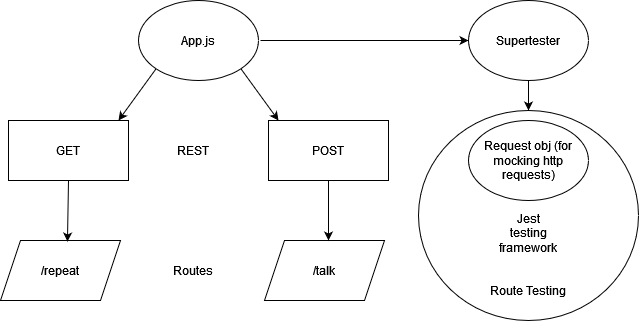

# Express Server

## Installation

  clone repo, and then run the 'npm i' command while in root directory to install dependencies.

## Summary of Problem Domain

  Application created with the purpose of practicing continuous integration and continuous delivery of a web application.

## Links to application deployment

  Deployment branch deployed [here](https://beers-server-deploy-dev.herokuapp.com/)

  Production branch deployed [here](https://beers-server-deploy-prod.herokuapp.com/)

  Pull req from dev found [here](https://github.com/Beers15/server-deployment-practice/pull/2)

## Uml Diagram

## Routes

* HTTP GET
  * Path: /foo
    * Demo route for application deployment practice

* HTTP POST
  * Path: /talk
    * Demo route for application deployment practice
    * supply query string argument with one of the queries having the name 'words' or make a post request with the response body have a property of 'words' in order to recieve a response
